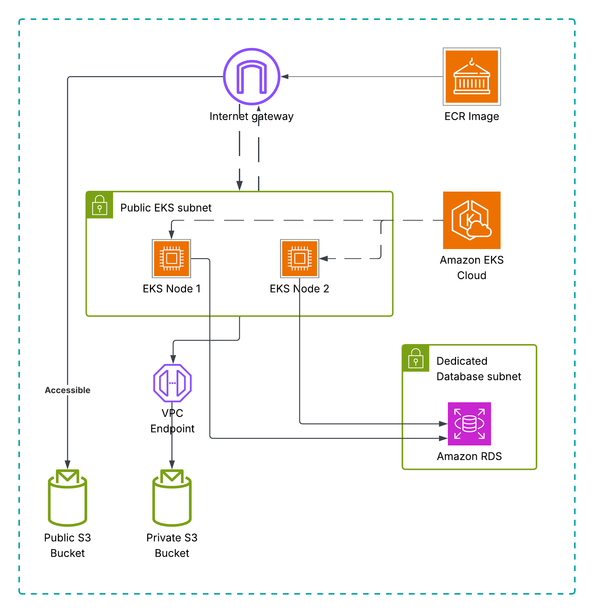

# BetterMe DevOps - AWS EKS Deployment

Simple deployment of a Node.js application on AWS EKS with PostgreSQL database and S3 storage.

## 🏗️ Architecture Diagram


## 🚀 Quick Start
### Prerequisites

1. **AWS CLI** configured with credentials
2. **Terraform** >= 1.0
3. **kubectl** >= 1.21  
4. **helm** >= 3.0

### 📦 What Gets Deployed

- **EKS Cluster** with ARM64 nodes (t4g.micro)
- **PostgreSQL RDS** database (db.t3.micro)
- **S3 Buckets** (public + private)
- **VPC** with subnets and security groups
- **LoadBalancer** for external access

## 🚀 Deploy Everything

```bash
# Deploy the entire infrastructure and application
./betterme.sh deploy
```

**That's it!** The script will:
1. ✅ Create AWS infrastructure with Terraform
2. ✅ Configure kubectl for EKS  
3. ✅ Deploy application with Helm
4. ✅ Show you the access URL

## 🧹 Destroy Everything

```bash
# Remove all AWS resources
./betterme.sh destroy
```

## 🌐 Access Your Application

After deployment, access your app via the URL:
```
https://betterme-test-mykola-palahniuk.space/
```

## 📊 Infrastructure Details

### **Networking**
- **VPC**: `10.0.0.0/16`
- **Public Subnets**: `10.0.1.0/24`, `10.0.2.0/24`
- **Private Subnets**: `10.0.10.0/24`, `10.0.20.0/24`
- **Database Subnets**: `10.0.30.0/24`, `10.0.40.0/24`

### **Compute**
- **EKS Version**: 1.28
- **Node Type**: t4g.micro (ARM64)
- **Node Count**: 2 (for high availability)
- **Application Replicas**: 1

### **Database**
- **Engine**: PostgreSQL 16
- **Instance**: db.t3.micro
- **Storage**: 20GB
- **Password**: `betterme123456` (simple for development)


## 💰 AWS Free Tier Costs

This setup is optimized for **AWS Free Tier**:
- ✅ **EKS Control Plane**: ~$3/month (unavoidable)
- ✅ **EC2 Instances**: 2x t4g.micro (Free Tier eligible)
- ✅ **RDS**: db.t3.micro (Free Tier eligible)
- ✅ **S3, VPC, etc.**: Minimal usage
